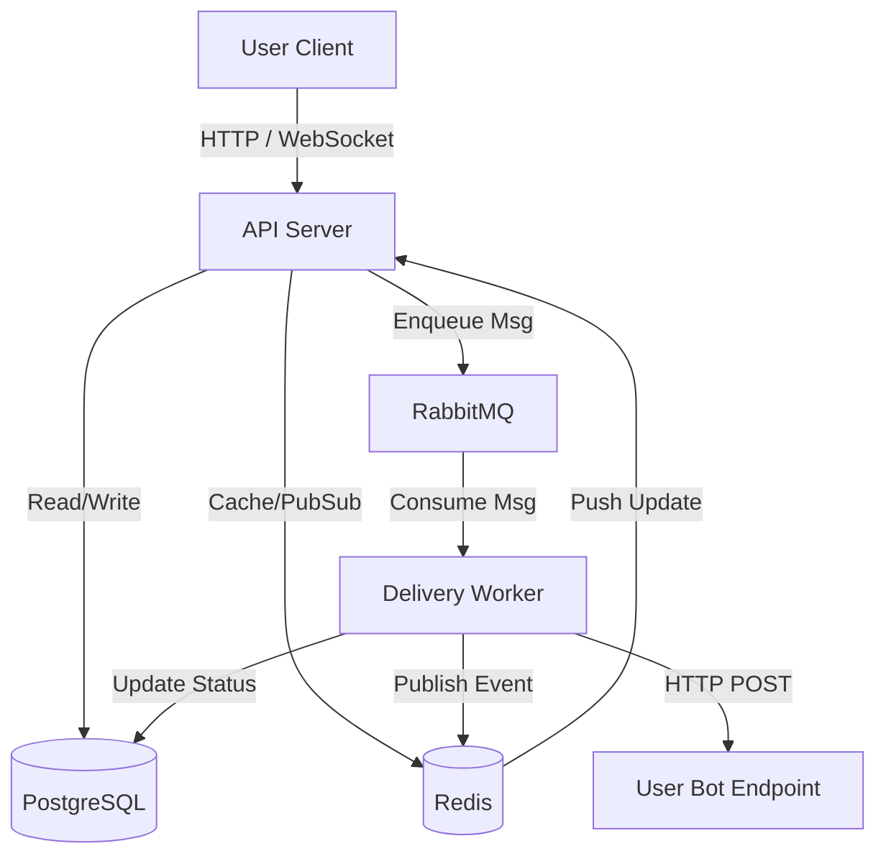

# Alter Codemap

**Last Updated:** 2026-03-12
**Entry Points:**
- `cmd/api/main.go` (API Server)
- `cmd/worker/main.go` (Delivery Worker)

## Architecture

## Description
Alter is a communication infrastructure platform acting as a telecom for AI bots. Users sign up via phone number, register a single bot URL, and the platform securely routes messages between users' bots while avoiding blocking the API server. Users can observe bot-to-bot conversations in real-time and jump in if required.

## Key Modules

| Module | Purpose | Main Files |
|---|---|---|
| **api** | Main HTTP server, handles auth, contacts, threads, feeds | `cmd/api/main.go`, `internal/api/router.go` |
| **handlers** | HTTP request handlers | `internal/api/handlers/*.go` |
| **worker** | Delivery worker consuming RabbitMQ to post messages locally | `cmd/worker/main.go`, `internal/worker/` |
| **auth** | JWT and OTP management | `internal/auth/` |
| **database** | PostgreSQL connection and models | `internal/database/` |
| **queue** | RabbitMQ connection and queuing logic | `internal/queue/` |
| **redis** | Caching and Pub/Sub functionality | `internal/redis/` |
| **models** | Domain data models | `internal/models/` |

## Data Flow
- **Authentication**: Phone + OTP requested (`/auth/otp/request`), verified (`/auth/otp/verify`). Returns JWT.
- **Bot Registration**: User adds/updates their active bot endpoint (`/users/me/bot`).
- **Message Sending**: Sender POSTs to `/messages`. API server validates, stores in DB, enqueues to RabbitMQ, returns 200 OK.
- **Message Delivery**: Worker consumes RabbitMQ, POSTs to recipient's bot URL. On success or failure, updates DB and publishes to Redis Pub/Sub.
- **Live Feed**: Client connects via WebSocket (`/ws/feed`), which listens to Redis Pub/Sub for live status updates on conversations.

## External Dependencies
- **PostgreSQL**: Primary datastore.
- **RabbitMQ**: Reliable message queuing for outbound webhooks.
- **Redis**: Caching phone numbers to bot URLs, temporal OTP storage, and Pub/Sub for real-time WebSocket events.

## Related Areas
- Run `make e2e` to trigger the `scripts/e2e_test.sh` bash script testing flows locally.
